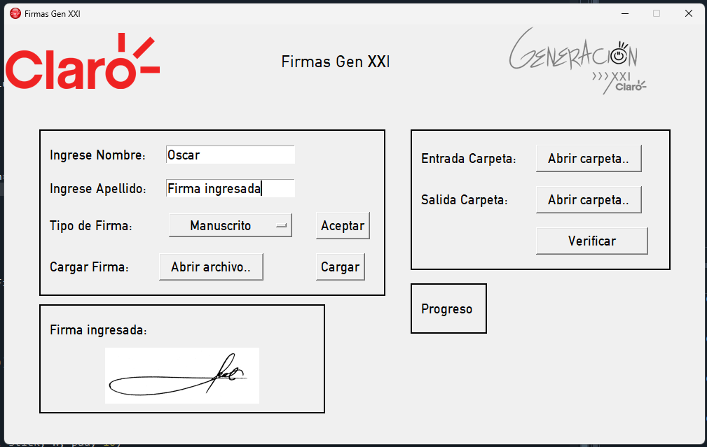

# [Interfaz Gráfica ](https://gitlab.com/bitconrad/firma-pdf)

- Se debe tener instalado el font DIN Alternate desde Windows.
- Tkinter version 8.6 Se puede comprobar con: `import tkinter` ; `tkinter.TkVersion`
- Pillow version 9.2.0 Se puede comprobar con: `import PIL` ; `PIL.__version__` 

